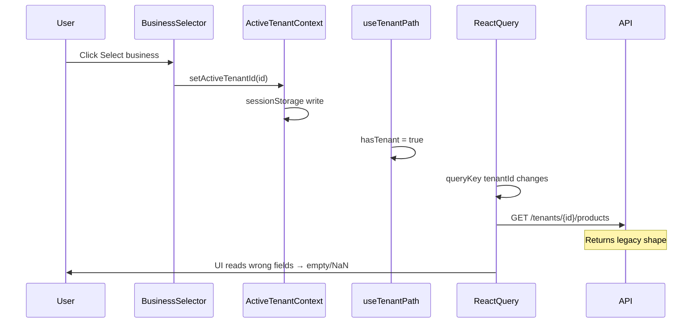

# Data & Dropdown Audit — Aryansh Mesh Frontend

**Date:** 2026-06-23  
**Dev server:** `http://localhost:5175/`  
**API base:** `http://localhost:8080/api/v1` (default from `VITE_API_BASE_URL`)  
**Audit method:** Static code analysis + legacy API cross-reference + user-reported live session evidence  
**Related:** [UI-AUDIT.md](UI-AUDIT.md) (shell, buttons, i18n, layout)

---

## Executive summary

| Category | Count | Impact |
|----------|-------|--------|
| **P0 — Crashes / no data fetch** | 3 | App crash on dashboard; business pages show empty while queries never run |
| **P1 — API shape mismatch** | 6 | API returns data but UI shows zeros, NaN, or blank columns |
| **P2 — Dropdown / Select broken** | 3 | Status filters and drawer selects may not open (z-index); prior header overlap on BusinessSelector |
| **P3 — Tenant switch UX** | 2 | Stale drawer state; old tenant cache retained 30s |

### Top 5 user-facing problems

1. **Dashboard crashes after tenant switch** — `recentActivity` was undefined (`DashboardPage.tsx:76`). Partially fixed with `?? []`; stats still wrong due to API field names.
2. **Products (and all business pages) appear empty** — Queries use `enabled: hasTenant`; when `activeTenantId` is empty (admin bootstrap) pages show **EmptyState** instead of loading. Pages only check `isLoading`, not `isPending`/`fetchStatus`.
3. **API returns legacy field names** — Backend uses `products`, `price`, `amount`, `customerName`; frontend expects `productCount`, `priceCents`, `amountCents`, `clientName`. Data exists in network tab but UI misreads it.
4. **Radix Select inside Sheet drawer** — `SelectContent` and `Sheet` both use `z-50`; status dropdown in product drawer may open behind overlay on mobile.
5. **BusinessSelector was unclickable** — Header flex overlap + controlled Radix dropdown bugs. Replaced with custom listbox; verify after hard refresh.

---

## Audit environment

| Item | Value |
|------|-------|
| Active source | `src/` only |
| User role (reported) | `PLATFORM_ADMIN` |
| Tenants API | **Working** — `GET /admin/tenants` returns 6 items including `tenant_souvenir_cafe` |
| Cursor browser MCP | **Unavailable** during audit (navigate/snapshot failed); login page only in MCP session |
| User browser (reported) | Logged in on `localhost:5175`; dashboard crash reproduced in console |

### Live verification status

| Check | Result | Source |
|-------|--------|--------|
| `GET /admin/tenants` returns items | **Pass** | User-provided response body |
| Dashboard crash on tenant switch | **Fail** | User console: `Cannot read properties of undefined (reading 'length')` at `DashboardPage.tsx:76` |
| Products list shows data | **Unverified live** / **Fail static** | Hook expects `priceCents`; legacy API uses `price` |
| BusinessSelector opens | **Partial fix** | Custom listbox in `BusinessSelector.tsx`; user reported still broken before header fix |
| UserMenu dropdown | **Static pass** | Uncontrolled Radix `DropdownMenu` |

---

## Issue registry

| ID | Sev | Area | Symptom | Root cause | File(s) | API endpoint | Fix |
|----|-----|------|---------|------------|---------|--------------|-----|
| DD-001 | P0 | All business pages | Empty lists, no loading spinner | `enabled: hasTenant` false when `activeTenantId === ''`; `isLoading` false when query disabled | `use-tenant-path.ts`, all `api/hooks/*`, all `pages/*` | `/tenants/{id}/*` never called | Add `useTenantReady()`; show loading until tenant set; use `isPending \|\| (isLoading && !data)` |
| DD-002 | P0 | Dashboard | **App crash** on render | `data.recentActivity` undefined; `.length` without guard | `DashboardPage.tsx` L76 | `GET .../dashboard` | **Fixed:** `?? []`. Backend should add `recentActivity` or map in hook |
| DD-003 | P0 | Dashboard | All stat cards show `0` / `—` | Frontend expects `productCount`, `bookingCount`, `clientCount`, `publishStatus`; backend returns `products`, `clients`, `testimonials`, `costs`, `hasUnpublishedChanges` | `use-dashboard.ts`, `entities.ts`, `DashboardPage.tsx` | `GET /tenants/{id}/dashboard` | Add `select` mapper in `useDashboard` from legacy `DashboardStats` |
| DD-004 | P1 | Products | Prices show `NaN` or list looks broken | Backend `price: number` (dollars); frontend `priceCents` | `use-products.ts`, `ProductsPage.tsx` L66, L352 | `GET /tenants/{id}/products` | Map `price * 100` → `priceCents` in hook `select` |
| DD-005 | P1 | Products | Empty when tenant not ready | Same as DD-001 | `ProductsPage.tsx` L98, L171–178 | `GET .../products` | Tenant ready gate + correct loading state |
| DD-006 | P1 | Costs | Amounts wrong / zero | Backend `amount`; frontend `amountCents` | `use-costs.ts`, `CostsPage.tsx` | `GET .../costs` | Map in hook `select` |
| DD-007 | P1 | Bookings | Blank client / date columns | Backend `customerName`, `date`, `time`; frontend `clientName`, `startsAt` | `use-bookings.ts`, `BookingsPage.tsx` | `GET .../bookings` | Map fields in hook `select` |
| DD-008 | P1 | Business profile | Empty or wrong fields | Backend `legalName`, `tagline`, `email`; frontend `name`, `slug`, `primaryColor` | `use-business-profile.ts`, `BusinessProfilePage.tsx` | `GET .../business` | Align types or map legacy → new |
| DD-009 | P1 | Publish | Wrong status / blank UI | Backend `hasUnpublishedChanges`, `draftCounts`; frontend `status`, `pendingChanges` | `use-publish.ts`, `PublishPage.tsx` | `GET .../publish/status` | Map legacy `PublishStatus` |
| DD-010 | P1 | Content | Items column blank | `itemCount` may be missing from API | `ContentPage.tsx`, `entities.ts` | `GET .../content/collections` | Default `itemCount ?? 0` |
| DD-011 | P2 | Products | Status filter Select doesn't open | `SelectContent` `z-50` same as `Sheet` overlay | `select.tsx` L78, `DetailDrawer.tsx`, `ProductsPage.tsx` L295–304 | — | Raise Select portal to `z-[100]` or `modal={false}` on Sheet |
| DD-012 | P2 | Products drawer | Status Select in form same z-index issue | Select inside `DetailDrawer` footer area | `ProductsPage.tsx` L502–513 | — | Same as DD-011 |
| DD-013 | P2 | Shell | BusinessSelector click no-op | Was: header overlap + controlled `onInteractOutside` | `Header.tsx`, `BusinessSelector.tsx` | — | **Fixed:** flex layout + custom listbox; re-verify |
| DD-014 | P2 | Admin tenant detail | Status / role Select | Standard Radix Select on page (not in Sheet) | `TenantDetailPage.tsx` L119–127, L144–152 | — | Likely **works**; verify live |
| DD-015 | P3 | CRUD pages | Wrong product in open drawer after tenant switch | Local `selected`/`draft` state not cleared on `activeTenantId` change | `ProductsPage.tsx`, `ClientsPage.tsx`, etc. | — | `useEffect` reset when `tenantId` changes |
| DD-016 | P3 | React Query | Stale data from previous tenant up to 30s | `staleTime: 30_000`; no cache removal on switch | `core/query/client.ts`, `ActiveTenantContext.tsx` | — | `removeQueries` on tenant change (optional) |
| DD-017 | P3 | Publish | Blank page body | `data ? ... : null` when query disabled | `PublishPage.tsx` L50 | — | Explicit `!hasTenant` empty state |
| DD-018 | P3 | Mutations | POST to wrong path if no tenant | Mutations don't check `hasTenant` | All `useCreate*` hooks | `POST /products` vs `/tenants/{id}/products` | Guard mutations when `!path` |

---

## API shape mismatch matrix

Reference legacy types: [`src.legacy/modules/business/types/tenant-api.ts`](src.legacy/modules/business/types/tenant-api.ts)  
Reference new types: [`src/modules/business/types/entities.ts`](src/modules/business/types/entities.ts)

| Endpoint | Backend field (legacy) | Frontend expects | Affected UI | Normalizer needed |
|----------|------------------------|------------------|-------------|-------------------|
| `GET .../dashboard` | `products` | `productCount` | Dashboard stat card | Yes |
| `GET .../dashboard` | `clients` | `clientCount` | Dashboard stat card | Yes |
| `GET .../dashboard` | `testimonials` | — (unused) | — | Optional |
| `GET .../dashboard` | `costs` | — (unused) | — | Optional |
| `GET .../dashboard` | `hasUnpublishedChanges` | `publishStatus` | Dashboard publish card | Map to `DRAFT`/`PUBLISHED` |
| `GET .../dashboard` | — | `bookingCount` | Dashboard | Default `0` or add to API |
| `GET .../dashboard` | — | `recentActivity[]` | Activity feed | Default `[]` (done) or API feed |
| `GET .../products` | `price` (number) | `priceCents` | Product card price | `price * 100` if `priceCents` absent |
| `GET .../costs` | `amount` | `amountCents` | Costs table | `amount * 100` |
| `GET .../costs` | `date` | `incurredAt` | Costs table | Rename in select |
| `GET .../bookings` | `customerName` | `clientName` | Bookings table | Rename |
| `GET .../bookings` | `date` + `time` | `startsAt` (ISO) | Bookings table | Combine to ISO string |
| `GET .../business` | `legalName`, `tagline`, `email` | `name`, `description`, `slug` | Business profile form | Field map |
| `GET .../publish/status` | `hasUnpublishedChanges`, `draftCounts` | `status`, `pendingChanges` | Publish page | Derive `status` from flags |
| List endpoints | `{ items, page, size, total }` | `{ items, total }` or `T[]` | All lists | **Already handled** in hook `select` |

### Example normalizer (products) — recommended pattern

```ts
// In use-products.ts select, after fetching:
select: (raw) => {
  const data = Array.isArray(raw) ? { items: raw, total: raw.length } : raw;
  return {
    ...data,
    items: data.items.map((p) => ({
      ...p,
      priceCents: p.priceCents ?? Math.round((p as { price?: number }).price ?? 0) * 100,
    })),
  };
},
```

### Example normalizer (dashboard) — recommended pattern

```ts
select: (raw: DashboardStats & DashboardSnapshot) => ({
  productCount: raw.productCount ?? raw.products ?? 0,
  clientCount: raw.clientCount ?? raw.clients ?? 0,
  bookingCount: raw.bookingCount ?? 0,
  publishStatus: raw.publishStatus ?? (raw.hasUnpublishedChanges ? 'DRAFT' : 'PUBLISHED'),
  recentActivity: raw.recentActivity ?? [],
}),
```

---

## Dropdown inventory

| Location | Component | Type | Works? | Notes |
|----------|-----------|------|--------|-------|
| [`Header.tsx`](src/shell/Header.tsx) | BusinessSelector | Custom listbox (`role="listbox"`) | **Fixed** (verify) | `z-[100]` panel; was blocked by header search overlap |
| [`Header.tsx`](src/shell/Header.tsx) | UserMenu | Radix `DropdownMenu` (uncontrolled) | **Likely OK** | No controlled `open` / `onInteractOutside` anti-pattern |
| [`CommandPalette.tsx`](src/shell/CommandPalette.tsx) | Command dialog | Radix `Dialog` | **OK** | ⌘K navigation; tenant switch via command items |
| [`ProductsPage.tsx`](src/modules/business/pages/ProductsPage.tsx) L295 | Status filter | Radix `Select` | **At risk** | `SelectContent` `z-50`; page-level, usually OK on desktop |
| [`ProductsPage.tsx`](src/modules/business/pages/ProductsPage.tsx) L502 | Drawer status field | Radix `Select` inside `DetailDrawer` | **Likely broken on mobile** | Same z-index as `Sheet` (`z-50`) |
| [`TenantDetailPage.tsx`](src/modules/admin/pages/TenantDetailPage.tsx) L119 | Tenant status | Radix `Select` | **Likely OK** | Not inside Sheet |
| [`TenantDetailPage.tsx`](src/modules/admin/pages/TenantDetailPage.tsx) L144 | Invite role | Radix `Select` | **Likely OK** | Not inside Sheet |
| Business CRUD pages | — | None | N/A | No dropdowns on clients, costs, locations, etc. |
| [`dropdown-menu.tsx`](src/design-system/components/ui/dropdown-menu.tsx) | Primitive | `z-50` portal | OK when uncontrolled | Avoid controlled `open` + `onInteractOutside` |

### Dropdown anti-patterns found (do not repeat)

1. **Controlled `DropdownMenu` + `onInteractOutside={() => setOpen(false)}`** — menu opens and immediately closes (was in old `BusinessSelector`).
2. **`SelectContent` at `z-50` inside `Sheet` at `z-50`** — dropdown renders behind modal overlay.
3. **Header `flex-1` search bar overlapping right-side controls** — steals pointer events (was in old `Header.tsx`).

---

## Per-page data checklist

Legend: **Pass** / **Fail** / **Partial** / **N/A** — based on static analysis + user reports.

| Page | Route | API called when tenant set | Load state correct | Data displays | Dropdowns | Tenant switch |
|------|-------|---------------------------|-------------------|---------------|-----------|---------------|
| Dashboard | `/dashboard` | `GET .../dashboard` | **Fail** — shows empty when no tenant | **Fail** — wrong fields; crash on `recentActivity` | N/A | **Fail** — crash reported |
| Products | `/products` | `GET .../products` | **Fail** — empty when no tenant | **Fail** — `priceCents` / NaN | **Partial** — filter OK; drawer select at risk | **Fail** — stale drawer |
| Clients | `/clients` | `GET .../clients` | **Fail** | **Partial** — list OK if API shape matches | N/A | **Fail** — stale drawer |
| Bookings | `/bookings` | `GET .../bookings` | **Fail** | **Fail** — column field mismatch | N/A | N/A |
| Costs | `/costs` | `GET .../costs` | **Fail** | **Fail** — `amountCents` mismatch | N/A | **Fail** — stale drawer |
| Locations | `/locations` | `GET .../locations` | **Fail** | **Partial** | N/A | **Fail** |
| Testimonials | `/testimonials` | `GET .../testimonials` | **Fail** | **Partial** | N/A | **Fail** |
| Content | `/content` | `GET .../collections` | **Fail** | **Partial** — `itemCount` | N/A | **Fail** |
| Business | `/business` | `GET .../business` | **Fail** | **Fail** — profile shape | N/A | N/A |
| Publish | `/publish` | `GET .../publish/status` | **Fail** | **Fail** — status shape; blank when no data | N/A | N/A |
| Admin tenants | `/admin/tenants` | `GET /admin/tenants` | **Pass** | **Pass** (user confirmed) | N/A | N/A |
| Admin tenant detail | `/admin/tenants/:id` | tenant + members APIs | **Partial** | **Partial** | **Likely pass** | N/A |

---

## Tenant scoping flow



### PLATFORM_ADMIN bootstrap timeline

| Step | `activeTenantId` | `hasTenant` | Products query | UI shows |
|------|------------------|-------------|----------------|----------|
| 1. Page load | `''` or stale session | false | **disabled** | EmptyState (misleading) |
| 2. `GET /admin/tenants` completes | `''` | false | disabled | EmptyState |
| 3. BusinessSelector auto-picks first | `tenant_...` | true | **fetches** | Loading → data or wrong shape |
| 4. User switches tenant | new id | true | refetch via key | Dashboard crash if `recentActivity` missing |

---

## Fix backlog

### Sprint 1 — P0 (stop crashes and false empty states)

| Task | Files |
|------|-------|
| Add `useTenantReady()` returning `{ tenantId, isReady: Boolean(tenantId) }` | New `src/modules/business/api/use-tenant-ready.ts` |
| Gate all business pages: if `!isReady` show skeleton, not EmptyState | All `pages/*Page.tsx` |
| Dashboard API normalizer + `recentActivity ?? []` | `use-dashboard.ts` (page already guarded) |
| Verify BusinessSelector + Header layout | `BusinessSelector.tsx`, `Header.tsx` |

### Sprint 2 — P1 (API normalizers)

| Task | Hook file |
|------|-----------|
| Map legacy dashboard stats | `use-dashboard.ts` |
| Map `price` → `priceCents` | `use-products.ts` |
| Map `amount` → `amountCents`, `date` → `incurredAt` | `use-costs.ts` |
| Map booking field names | `use-bookings.ts` |
| Map business profile fields | `use-business-profile.ts` |
| Map publish status | `use-publish.ts` |

### Sprint 3 — P2 (dropdowns)

| Task | Files |
|------|-------|
| Raise `SelectContent` default z-index to `z-[100]` | `select.tsx` |
| Or pass `className="z-[100]"` on drawer Selects only | `ProductsPage.tsx` |
| Document BusinessSelector pattern as reference for shell menus | `BusinessSelector.tsx` |

### Sprint 4 — P3 (tenant switch polish)

| Task | Files |
|------|-------|
| Reset drawer state on `activeTenantId` change | CRUD pages |
| `queryClient.removeQueries({ queryKey: ['business', oldId] })` on switch | `ActiveTenantContext.tsx` |
| PublishPage `!hasTenant` empty state | `PublishPage.tsx` |
| Mutation guards when `!hasTenant` | All mutation hooks |

---

## Network verification checklist (for manual re-test)

After fixes, confirm in DevTools → Network while logged in as PLATFORM_ADMIN:

| # | Action | Expected request | Expected UI |
|---|--------|------------------|-------------|
| 1 | Load app | `GET /admin/tenants` → 200, 6 items | BusinessSelector shows tenant name |
| 2 | Open `/products` | `GET /tenants/{activeId}/products` → 200 | Product cards with real prices |
| 3 | Click status filter Select | No network | Dropdown opens, filters list |
| 4 | Open product drawer → status Select | No network | Dropdown opens above drawer |
| 5 | Switch to Souvenir Café | `GET /tenants/tenant_souvenir_cafe/dashboard` | No crash; stats > 0 if tenant has data |
| 6 | UserMenu avatar click | No network | Language + logout menu opens |

---

## Files reference

| Concern | Path |
|---------|------|
| Tenant context | [`src/core/tenant/ActiveTenantContext.tsx`](src/core/tenant/ActiveTenantContext.tsx) |
| Tenant path helper | [`src/modules/business/api/use-tenant-path.ts`](src/modules/business/api/use-tenant-path.ts) |
| Business selector | [`src/shell/BusinessSelector.tsx`](src/shell/BusinessSelector.tsx) |
| Products hook | [`src/modules/business/api/hooks/use-products.ts`](src/modules/business/api/hooks/use-products.ts) |
| Dashboard hook | [`src/modules/business/api/hooks/use-dashboard.ts`](src/modules/business/api/hooks/use-dashboard.ts) |
| Select primitive | [`src/design-system/components/ui/select.tsx`](src/design-system/components/ui/select.tsx) |
| Detail drawer | [`src/shared/components/DetailDrawer.tsx`](src/shared/components/DetailDrawer.tsx) |
| Legacy API types | [`src.legacy/modules/business/types/tenant-api.ts`](src.legacy/modules/business/types/tenant-api.ts) |
| Query defaults | [`src/core/query/client.ts`](src/core/query/client.ts) |

---

*Generated 2026-06-23. Cursor browser MCP was unavailable for authenticated walkthrough; findings combine static analysis, legacy API comparison, and user-reported console/network evidence.*
