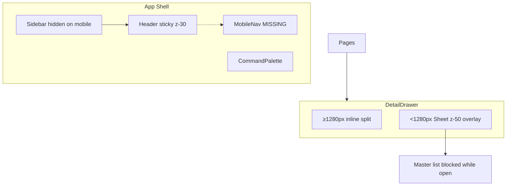

# UI Audit — Aryansh Mesh Frontend

> **See also:** [DATA-DROPDOWN-AUDIT.md](DATA-DROPDOWN-AUDIT.md) — data loading, API shape mismatches, and dropdown/Select failures.

**Date:** 2026-06-22  
**Branch:** working tree (uncommitted)  
**Active source:** `src/` (not `src.legacy/`)  
**Dev server:** `http://localhost:5175/`  
**Audit method:** Static code analysis + live browser verification (Cursor Browse MCP)

---

## Executive summary

| Severity | Count | Description |
|----------|-------|-------------|
| **P0** | 4 | Broken navigation, dead row actions, silent auth edge case |
| **P1** | 5 | Button defaults, disabled UX, drawer/sheet friction, a11y gaps |
| **P2** | 18 pages | Hardcoded English (buttons, toasts, empty/error states) |
| **P3** | 14 instances | Inline `text-[Npx]` token violations |
| **P4** | 3 | Incomplete features / discoverability gaps |

### Top 5 user-facing problems

1. **Settings & Profile links go to a 404** — User menu and sidebar link to `/settings`, which has no route. **Live verified.**
2. **No mobile navigation** — Sidebar is hidden below `md` (768px) with no hamburger or sheet fallback; users cannot reach most pages on phone.
3. **Row action buttons disable globally** — Approving one social post or removing one tenant member disables the same buttons on every other row.
4. **Mobile detail drawer blocks the list** — Below 1280px, opening a drawer overlays the master list; background rows feel “unclickable.”
5. **Inconsistent i18n** — Only `ProductsPage` fully uses locale keys; most CRUD pages hardcode English labels, toasts, and drawer actions (French locale incomplete in UI).

---

## Audit scope & environment

### Routes covered

| Area | Routes |
|------|--------|
| Business | `/dashboard`, `/products`, `/clients`, `/bookings`, `/costs`, `/locations`, `/testimonials`, `/content`, `/business`, `/publish`, `/onboarding` |
| Marketing | `/marketing`, `/marketing/companies`, `/marketing/companies/:id`, `/marketing/projects/:id`, threads, brand-memory, social |
| Admin | `/admin/tenants`, `/admin/tenants/new`, `/admin/tenants/:id` |
| Auth | `/auth/login`, `/auth/signup`, `/auth/forgot-password`, `/auth/accept-invite` |
| Shell | Command palette (⌘K), BusinessSelector, UserMenu, Settings link |
| Broken | `/settings` |

### Viewports

| Viewport | Method | Result |
|----------|--------|--------|
| Desktop ≥1280px | Static (`useIsWide`, `DetailDrawer`) | Split-pane drawer; sidebar visible |
| Tablet/mobile <768px | Static (`Sidebar` `hidden md:flex`) | **No sidebar; no mobile nav component** |
| Mobile drawer <1280px | Static (`DetailDrawer` + `Sheet`) | Modal overlay blocks master pane |

### Live verification notes

The Cursor browser session is **not authenticated** (separate from your logged-in browser). Verified live:

| Route | Result | Verified |
|-------|--------|----------|
| `/dashboard` | Redirects to `/auth/login` when unauthenticated | Live |
| `/auth/login` | Login form renders (email, password, Sign in, Forgot password) | Live |
| `/settings` | **404 — “Page not found”** with “Back to dashboard” link | Live |

All other findings below are **statically verified** from source unless marked Live.

---

## Issue registry

| ID | Sev | Page / Area | Symptom | Root cause | File(s) | Suggested fix | Locale keys | Verified |
|----|-----|-------------|---------|------------|---------|---------------|-------------|----------|
| UI-001 | P0 | Shell | Settings / Profile → 404 | No `/settings` route; links in UserMenu + Sidebar | `src/shell/UserMenu.tsx` L40–46, `src/shell/Sidebar.tsx` L111–117, `src/modules/business/routes.tsx` | Add route wiring to settings page **or** remove links until ready | `shell.settings`, `shell.profile` exist | **Live** |
| UI-002 | P0 | Shell (mobile) | Cannot navigate on phone | Sidebar `hidden md:flex`; no mobile nav | `src/shell/Sidebar.tsx` L20, `src/shell/AppShell.tsx`, `src/shell/Header.tsx` | Add `MobileNav` sheet + menu button in Header | `shell.openMenu`, `shell.closeMenu` (new) | Static |
| UI-003 | P0 | Social calendar | All Approve/Reject buttons freeze when one is clicked | `disabled={approveMutation.isPending}` not scoped to post ID | `src/modules/marketing/pages/SocialCalendarPage.tsx` L119–122 | `disabled={approveMutation.isPending && approveMutation.variables === post.id}` | `marketing.approve`, `marketing.reject` (new) | Static |
| UI-004 | P0 | Tenant detail | All remove-member buttons freeze when one is clicked | `disabled={removeMutation.isPending}` on every row | `src/modules/admin/pages/TenantDetailPage.tsx` L182–185 | Scope to `removeMutation.variables === m.uid` | `admin.removeMember` (new) | Static |
| UI-005 | P0 | Accept invite | Button disabled forever when token missing; no error shown | Error only set inside `accept()` which never runs | `src/modules/auth/pages/AcceptInvitePage.tsx` L45–46 | Show `t('auth.inviteMissing')` when `!token` on render | `auth.inviteMissing` exists | Static |
| UI-006 | P1 | Design system | Buttons inside future forms may submit unintentionally | `Button` has no default `type="button"` | `src/design-system/components/ui/button.tsx` L46–54 | Default `type="button"` when not `asChild` and no explicit type | — | Static |
| UI-007 | P1 | Design system | Disabled buttons feel “dead” | `disabled:pointer-events-none disabled:opacity-50` | `src/design-system/components/ui/button.tsx` L8 | Add `disabled:cursor-not-allowed`; consider removing `pointer-events-none` | — | Static |
| UI-008 | P1 | CRUD pages (mobile) | List rows unclickable while drawer open | Sheet overlay covers master pane | `src/shared/components/DetailDrawer.tsx` L58–75, `src/design-system/components/ui/sheet.tsx` | Document expected UX **or** use non-modal sheet / tap-outside dismiss | — | Static |
| UI-009 | P1 | Detail drawer (mobile) | Two overlapping close buttons | Sheet built-in X + DrawerInner X | `src/design-system/components/ui/sheet.tsx` L67–70, `src/shared/components/DetailDrawer.tsx` L102–109 | Add `hideCloseButton` prop to `SheetContent` | `common.close` (new) | Static |
| UI-010 | P1 | List views | Table rows not keyboard-accessible | `<tr onClick>` without tabIndex/role | `ClientsPage`, `CostsPage`, `ContentPage`, `ProductsPage` | Use `<button>` in first cell or `tabIndex={0}` + `onKeyDown` | — | Static |
| UI-011 | P2 | All CRUD except Products | English-only buttons, toasts, empty states | Hardcoded strings in JSX | See locale gap table below | Mirror `ProductsPage` pattern | Per-page keys | Static |
| UI-012 | P2 | ViewToggle | “Cards” / “List” not translated | Hardcoded labels | `src/shared/components/ViewToggle.tsx` L33, L47 | `common.viewCards`, `common.viewList` | New keys | Static |
| UI-013 | P2 | DetailDrawer | Close aria-label hardcoded | `aria-label="Close"` | `src/shared/components/DetailDrawer.tsx` L105 | `t('common.close')` | New key | Static |
| UI-014 | P2 | Thread workspace | Send button icon-only, no aria-label | Missing accessibility label | `src/modules/marketing/pages/ThreadWorkspacePage.tsx` | Add `aria-label={t('marketing.sendMessage')}` | New key | Static |
| UI-015 | P2 | Command palette | “Switch business” hardcoded | Admin-only group heading | `src/shell/CommandPalette.tsx` L56 | `shell.switchBusiness` | New key | Static |
| UI-016 | P2 | BusinessSelector | Hardcoded English | Not using i18n | `src/shell/BusinessSelector.tsx` L35–42 | Use `t('shell.switchBusiness')`, etc. | New keys | Static |
| UI-017 | P3 | Shell + pages | CI token check fails | Inline `text-[Npx]` | See token table below | Replace with `.typo-*` from `typography.ts` | — | Static |
| UI-018 | P3 | Business profile | Raw hex in placeholder | `#3B82F6` in input placeholder | `src/modules/business/pages/BusinessProfilePage.tsx` L97 | Move default to token file if used as value | — | Static |
| UI-019 | P4 | Bookings | Read-only list, no actions | No drawer/detail flow | `src/modules/business/pages/BookingsPage.tsx` | Add detail view or document as intentional | `bookings.*` keys needed | Static |
| UI-020 | P4 | Marketing nav | Agency overview hard to discover | Sidebar only links to `/marketing/companies` | `src/shell/navigation.ts` L44 | Add overview link or redirect `/marketing` → companies | — | Static |

---

## Design token violations

`scripts/check-design-tokens.sh` flags inline `text-[Npx]`. Replace with utilities from `src/design-system/tokens/typography.ts` / `globals.css`.

| File | Line | Current | Recommended replacement |
|------|------|---------|-------------------------|
| `src/shell/Sidebar.tsx` | 24 | `text-[10px]` on brand monogram | `typo-eyebrow` (11px — closest token) |
| `src/shell/Sidebar.tsx` | 27 | `text-[13px] font-semibold` | `typo-body-sm font-semibold` or `typo-subhead` |
| `src/shell/Sidebar.tsx` | 30 | `text-[10px] uppercase` | `typo-eyebrow-upper` |
| `src/shell/Sidebar.tsx` | 45 | `text-[10px]` on kbd | `typo-eyebrow` |
| `src/shell/Sidebar.tsx` | 76 | `text-[13px] font-medium` | `typo-body-sm font-medium` |
| `src/shell/Sidebar.tsx` | 100 | `text-[11px] font-semibold` | `typo-caption font-semibold` |
| `src/shell/Sidebar.tsx` | 104 | `text-[12px] font-medium` | `typo-caption font-medium` |
| `src/shell/Sidebar.tsx` | 107 | `text-[10px] uppercase` | `typo-eyebrow-upper` |
| `src/shell/Header.tsx` | 24 | `text-[13px]` breadcrumb | `typo-body-sm` |
| `src/shell/Header.tsx` | 41 | `text-[10px]` kbd | `typo-eyebrow` |
| `src/shell/UserMenu.tsx` | 26 | `text-[11px] font-semibold` | `typo-caption font-semibold` |
| `src/shell/UserMenu.tsx` | 36 | `text-[11px]` email | `typo-caption text-muted-foreground` |
| `src/shared/components/StatusBadge.tsx` | 23 | `text-[11px]` | `typo-caption` |
| `src/modules/business/pages/DashboardPage.tsx` | 88 | `text-[10px] uppercase` | `typo-eyebrow-upper` |
| `src/modules/marketing/pages/ThreadWorkspacePage.tsx` | 91 | `text-[10px] tabular-nums` | `typo-eyebrow typo-tabular` |

### Raw hex (non-token file)

| File | Line | Value | Fix |
|------|------|-------|-----|
| `src/modules/business/pages/BusinessProfilePage.tsx` | 97 | `placeholder="#3B82F6"` | If used as default brand color, add to `globals.css` CSS variable; placeholder can stay as user hint or use token name |

Allowed hex locations: `globals.css`, `platformColors.ts` only.

---

## Locale gap analysis

**Reference implementation:** `src/modules/business/pages/ProductsPage.tsx` — uses `t()` for page title, actions, drawer footer, form labels, toasts, empty/error states, and search/filter UI.

**Existing shared keys** (`locales/en.json`): `common.cancel`, `common.delete`, `common.save`, `common.loading` — most pages ignore these.

### Per-page missing keys

Keys marked ✅ exist in locale files but are **not used** in the page component.

#### Business module

| Page | Uses i18n for | Hardcoded (needs keys) | Suggested namespace keys |
|------|---------------|------------------------|--------------------------|
| **ProductsPage** | ✅ Full | — | Reference |
| **ClientsPage** | title, subtitle only | Add Client, New Client, Cancel, Save, Saving…, Delete, Name/Email/Phone/Notes labels, toasts, empty/error states, table headers | `clients.addClient`, `clients.newClient`, `clients.field*`, `clients.created`, `clients.updated`, `clients.deleted`, `clients.error*`, `clients.empty*` |
| **CostsPage** | title, subtitle | Same CRUD pattern as Clients | `costs.addCost`, `costs.newCost`, … |
| **LocationsPage** | title, subtitle | Same CRUD pattern; card buttons use native `<button>` | `locations.addLocation`, … |
| **TestimonialsPage** | title, subtitle | Same CRUD pattern | `testimonials.addTestimonial`, … |
| **ContentPage** | title, subtitle | Same CRUD pattern | `content.addCollection`, … |
| **BookingsPage** | title, subtitle | Empty/error/table headers | `bookings.empty*`, `bookings.error*`, `bookings.field*` |
| **BusinessProfilePage** | title, subtitle | Save, Saving…, field labels, toasts | `business.save`, `business.field*`, `business.updated` |
| **PublishPage** | title, subtitle | Publish Now, Publishing…, toasts | `publish.publishNow`, `publish.publishing`, `publish.started` |
| **DashboardPage** | partial | Activity labels if any hardcoded | Extend `dashboard.*` |
| **OnboardingPage** | partial | Step copy if hardcoded | Extend `onboarding.*` |

#### Marketing module

| Page | Uses i18n for | Hardcoded | Suggested keys |
|------|---------------|-----------|----------------|
| **AgencyOverviewPage** | title, subtitle | Empty/error copy | `marketing.overviewEmpty*` |
| **CompaniesPage** | title, subtitle | Add Company, New Company, Cancel, Create, toasts, empty/error | `marketing.addCompany`, `marketing.newCompany`, … |
| **CompanyProjectsPage** | title, subtitle | Add Project, New Project, … | `marketing.addProject`, … |
| **ProjectDashboardPage** | title, subtitle | New Thread, Create, … | `marketing.newThread`, … |
| **ThreadWorkspacePage** | partial | Placeholder, Send (no label), error title | `marketing.messagePlaceholder`, `marketing.sendMessage` |
| **BrandMemoryPage** | title, subtitle | Save, placeholder, toasts | `marketing.brandMemoryPlaceholder`, `marketing.saved` |
| **SocialCalendarPage** | title, subtitle | Add Post, Approve, Reject, Cancel, Create, field labels, toasts, empty/error | `marketing.addPost`, `marketing.approve`, `marketing.reject`, … |

#### Admin module

| Page | Hardcoded | Suggested keys |
|------|-----------|----------------|
| **TenantListPage** | New Tenant, empty/error | `admin.newTenant`, `admin.empty*` |
| **TenantDetailPage** | Save Changes, Send Invite, Saving…, table headers, toasts, Remove member aria-label | `admin.saveChanges`, `admin.sendInvite`, `admin.removeMember`, … |
| **TenantCreatePage** | Validation toasts (partial i18n) | `admin.nameSlugRequired`, `admin.tenantCreated` |

#### Shared components

| Component | Hardcoded | Keys |
|-----------|-----------|------|
| **ViewToggle** | Cards, List | `common.viewCards`, `common.viewList` |
| **DetailDrawer** | Close (aria-label) | `common.close` |
| **BusinessSelector** | Select business, Switch business, No businesses found | `shell.selectBusiness`, `shell.switchBusiness`, `shell.noBusinesses` |
| **CommandPalette** | Switch business (heading) | `shell.switchBusiness` |

### French locale (`locales/fr.json`)

Mirror every new English key above. Current `fr.json` structure matches `en.json` but most page-specific keys beyond `products.*` are **missing** — adding keys to both files in the same PR is required.

---

## Fix backlog by sprint

### Sprint 1 — P0 broken interactions (highest impact)

| Task | File(s) | Pattern |
|------|---------|---------|
| Wire or remove Settings route | `src/modules/business/routes.tsx`, optionally wire `src/modules/business/features/settings/AccountPage.tsx` | `<Route path="settings" element={<AccountPage />} />` **or** remove `navigate('/settings')` from UserMenu/Sidebar |
| Add mobile navigation | New `src/shell/MobileNav.tsx`, update `Header.tsx` | Sheet with `NAV_ITEMS` map; menu button visible `md:hidden` |
| Scope mutation disabled state | `SocialCalendarPage.tsx` L119–122 | `disabled={approveMutation.isPending && approveMutation.variables === post.id}` |
| Scope remove-member disabled | `TenantDetailPage.tsx` L185 | `disabled={removeMutation.isPending && removeMutation.variables === m.uid}` |
| Accept invite missing token UX | `AcceptInvitePage.tsx` | `{!token && <Alert>…t('auth.inviteMissing')…</Alert>}` |

### Sprint 2 — Design-system fixes

| Task | File | Change |
|------|------|--------|
| Default button type | `src/design-system/components/ui/button.tsx` | `type={props.type ?? (asChild ? undefined : 'button')}` |
| Disabled button feedback | `button.tsx` L8 | Replace `disabled:pointer-events-none` with `disabled:cursor-not-allowed` |
| Dedupe sheet close button | `sheet.tsx` + `DetailDrawer.tsx` | Add `showClose?: boolean` to SheetContent; pass `showClose={false}` from DetailDrawer |
| Document mobile drawer overlay | `DetailDrawer.tsx` or this doc | Optional: `modal={false}` on Sheet if list interaction while drawer open is desired |

### Sprint 3 — i18n sweep (ProductsPage template)

Work module-by-module. For each CRUD page, replace hardcoded strings with `t()` and add keys to **both** `locales/en.json` and `locales/fr.json`.

**Order:** Business CRUD → Marketing → Admin → Shell shared components.

**Drawer footer template** (from ProductsPage):

```tsx
<Button variant="outline" onClick={closeDrawer}>{t('common.cancel')}</Button>
<Button onClick={() => void onSave()} disabled={isPending}>
  {isPending ? t('common.loading') : t('common.save')}
</Button>
```

**Toast template:**

```tsx
toast.success(t('clients.created'));
toast.error((e as Error).message || t('clients.saveFailed'));
```

### Sprint 4 — Accessibility & token cleanup

| Task | Files |
|------|-------|
| Keyboard-accessible table rows | `ClientsPage`, `CostsPage`, `ContentPage`, `ProductsPage` list views |
| Icon button aria-labels | `ThreadWorkspacePage` Send button |
| Replace `text-[Npx]` | All files in token violations table |
| Run `scripts/check-design-tokens.sh` | CI must pass before merge |

---

## Per-page checklists

Legend: ✅ Pass · ⚠️ Partial · ❌ Fail · 🔒 Auth required (not live-tested)

### Shell

| Check | Desktop | Mobile | Notes |
|-------|---------|--------|-------|
| Sidebar nav visible | ✅ | ❌ UI-002 | Hidden `md:hidden` |
| Header breadcrumb | ✅ | ✅ | |
| Command palette ⌘K | ✅ | ⚠️ | Works but undiscoverable on mobile |
| User menu logout | 🔒 | 🔒 | |
| Settings link | ❌ UI-001 | ❌ | **Live 404 verified** |
| Business selector (admin) | 🔒 | 🔒 | Hardcoded English UI-016 |
| French locale | ⚠️ | ⚠️ | Nav uses i18n; selector hardcoded |

### Business pages

| Page | Nav | Primary CTA | Drawer CRUD | Empty state | Error + retry | i18n |
|------|-----|-------------|-------------|-------------|---------------|------|
| `/dashboard` | 🔒 | — | — | ⚠️ | ⚠️ | ⚠️ |
| `/products` | 🔒 | ✅ | ✅ | ✅ | ✅ | ✅ Reference |
| `/clients` | 🔒 | ✅ | ✅ | ⚠️ hardcoded | ⚠️ | ❌ |
| `/bookings` | 🔒 | — | — | ⚠️ | ⚠️ | ❌ UI-019 |
| `/costs` | 🔒 | ✅ | ✅ | ⚠️ | ⚠️ | ❌ |
| `/locations` | 🔒 | ✅ | ✅ | ⚠️ | ⚠️ | ❌ |
| `/testimonials` | 🔒 | ✅ | ✅ | ⚠️ | ⚠️ | ❌ |
| `/content` | 🔒 | ✅ | ✅ | ⚠️ | ⚠️ | ❌ |
| `/business` | 🔒 | ✅ Save | — | — | ⚠️ | ❌ |
| `/publish` | 🔒 | ✅ | — | — | ⚠️ | ❌ |
| `/onboarding` | 🔒 | ⚠️ | — | — | — | ⚠️ |

### Marketing pages

| Page | Nav | Primary CTA | Drawer/Actions | i18n | Known bugs |
|------|-----|-------------|----------------|------|------------|
| `/marketing` | 🔒 | — | — | ⚠️ | UI-020 discoverability |
| `/marketing/companies` | 🔒 | ✅ | ✅ | ❌ | |
| Company projects | 🔒 | ✅ | ✅ | ❌ | |
| Project dashboard | 🔒 | ✅ | ✅ | ❌ | |
| Thread workspace | 🔒 | ✅ Send | — | ❌ | UI-014 aria-label |
| Brand memory | 🔒 | ✅ Save | — | ❌ | |
| Social calendar | 🔒 | ✅ | ✅ Approve/Reject | ❌ | **UI-003 global disable** |

### Admin pages

| Page | Nav | Primary CTA | i18n | Known bugs |
|------|-----|-------------|------|------------|
| `/admin/tenants` | 🔒 | ✅ New Tenant | ❌ | |
| `/admin/tenants/new` | 🔒 | ✅ Submit/Cancel | ⚠️ | Uses `type="button"` on cancel ✅ |
| `/admin/tenants/:id` | 🔒 | ✅ Save/Invite | ❌ | **UI-004 global remove disable** |

### Auth pages

| Page | Form submit | i18n | Known bugs |
|------|-------------|------|------------|
| `/auth/login` | ✅ Live | ✅ | |
| `/auth/signup` | ✅ | ✅ | |
| `/auth/forgot-password` | ✅ | ✅ | |
| `/auth/accept-invite` | ⚠️ | ✅ keys exist | **UI-005 missing token UX** |

---

## Reference patterns (copy these)

| Pattern | File | Lines |
|---------|------|-------|
| Full i18n CRUD page | `src/modules/business/pages/ProductsPage.tsx` | entire file |
| `type="button"` on cancel in form | `src/modules/admin/pages/TenantCreatePage.tsx` | L73 |
| `Button asChild` + `Link` navigation | `src/shared/components/NotFoundPage.tsx` | L18–20 |
| `Button asChild` + `Link` (admin) | `src/modules/admin/pages/TenantListPage.tsx` | L30–34 |
| Locale init | `src/core/i18n/index.ts` | |
| Typography tokens | `src/design-system/tokens/typography.ts` | |
| Color tokens | `src/design-system/styles/globals.css` | CSS variables |

---

## Architecture notes



---

## Next steps

1. **You (review):** Prioritize Sprint 1 items — Settings 404 and mobile nav are the most visible breakages.
2. **Implementation:** Request fixes per sprint; each i18n batch should update `locales/en.json` and `locales/fr.json` together.
3. **Re-audit:** After Sprint 1–2, re-run live pass in an authenticated browser session on `http://localhost:5175/` at 375px and 1440px widths.

---

*Generated from static analysis of `src/` and live verification on `http://localhost:5175/` (login + `/settings` 404). Authenticated route interactions marked 🔒 require a logged-in session in the audit browser.*
