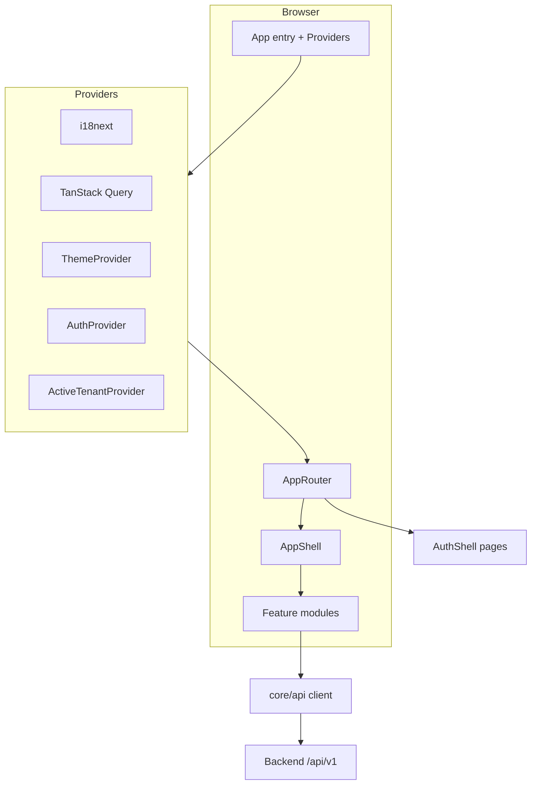
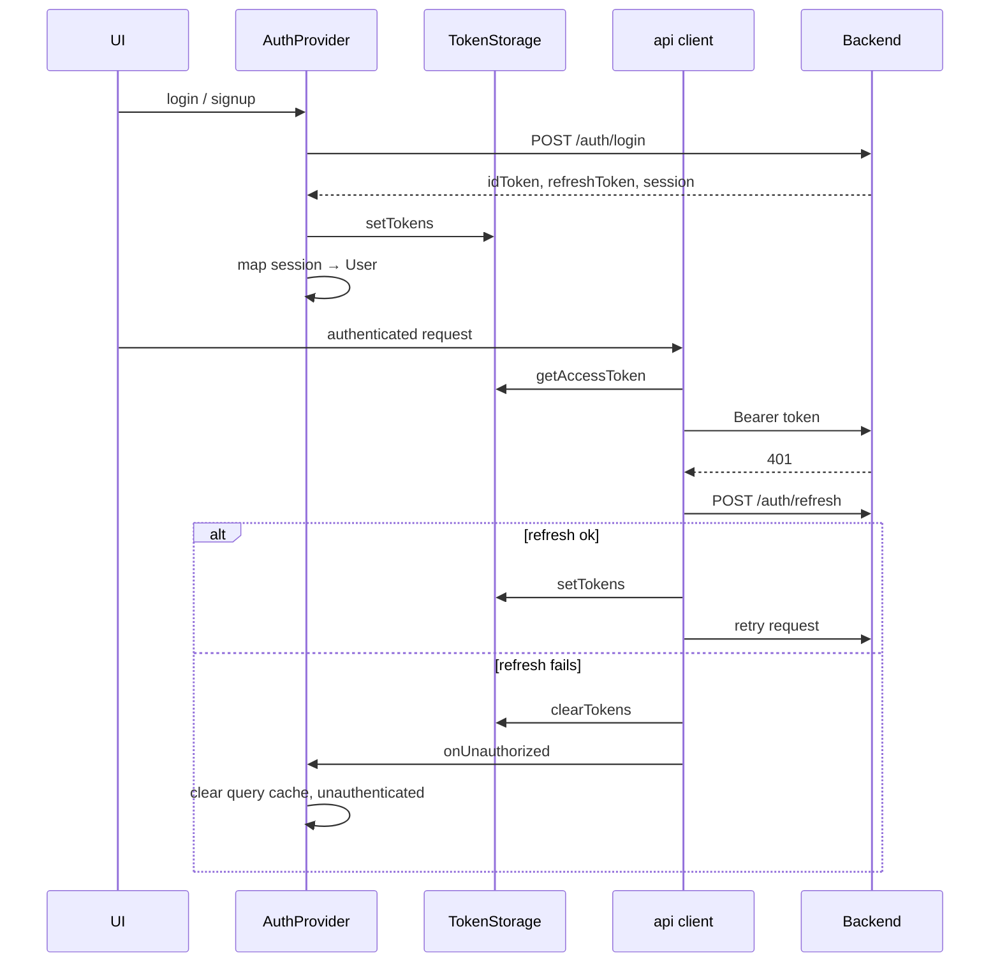
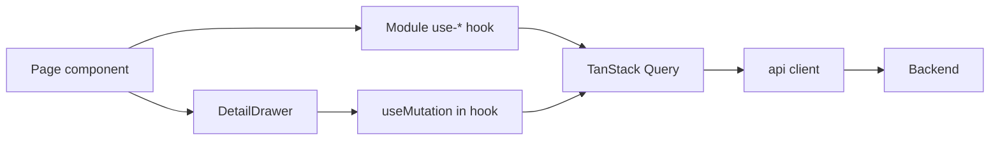

# Architecture

Aryansh Mesh Frontend is a single-page application that hosts Business Manager, Marketing Hub, and platform admin behind one authenticated shell. This document describes how the codebase is organized and how data and UI flows work.

## Goals

- One SPA, one auth session, one design system
- Clear module boundaries (business / marketing / admin / auth)
- Tenant-scoped API access with a shared HTTP client
- Responsive detail UX (drawer / split pane) without fragile nested overlays
- EN / FR i18n and tokenized styling

## High-level layout

## Directory layers

| Layer | Path | Responsibility |
|-------|------|----------------|
| App | `src/app/` | Bootstrap (`main.tsx`), provider tree, route table |
| Core | `src/core/` | Cross-cutting infrastructure: auth, API, tenant, i18n, theme, query client |
| Design system | `src/design-system/` | Tokens, global CSS, shadcn primitives |
| Shell | `src/shell/` | Persistent chrome: sidebar, header, mobile nav, command palette |
| Modules | `src/modules/*` | Product features (pages, hooks, module-local components) |
| Shared | `src/shared/` | Reusable UI patterns used by more than one module |
| Locales | `locales/` | Translation catalogs |

Modules must not import from each other. Shared behavior belongs in `core/` or `shared/`.

## Provider stack

Order in `src/app/providers.tsx`:

1. **I18nextProvider** — language and `t()` for all UI copy
2. **QueryClientProvider** — server state cache
3. **ThemeProvider** — dark-first theme tokens
4. **AuthProvider** — session, login/logout, unauthorized handling
5. **ActiveTenantProvider** — current tenant for scoped API calls

Toasts (`sonner`) sit inside the tenant provider so authenticated flows can notify consistently.

## Routing

`src/app/router.tsx` defines three top-level areas:

| Guard | Shell | Content |
|-------|-------|---------|
| `GuestRoute` | `AuthShell` | Login, signup, forgot password |
| Public (invite) | `AuthShell` | Accept invite (token in query) |
| `ProtectedRoute` | `AppShell` | Business, marketing, admin routes |

Module route fragments are composed into the protected tree:

- `businessRoutes` — flat paths under `/` (`/dashboard`, `/products`, …)
- `marketingRoutes` — nested under `/marketing` with `MarketingLayout`
- `adminRoutes` — nested under `/admin`, wrapped in `AdminRoute` (platform admin only)

Navigation labels and icons live in `src/shell/navigation.ts`. Admin items use `requireRole: 'PLATFORM_ADMIN'`.

## Auth and session

Key files:

- `src/core/auth/AuthProvider.tsx` — session state, login/signup/invite/logout, clears React Query on auth transitions
- `src/core/auth/token-storage.ts` — access/refresh tokens in storage
- `src/core/auth/guards.tsx` — `ProtectedRoute`, `GuestRoute`, `AdminRoute`
- `src/core/auth/landing.ts` — post-login redirect targets
- `src/core/api/client.ts` — Bearer injection, single-flight refresh, unauthorized callback

Roles mapped from backend session:

| Backend | Frontend `User.role` |
|---------|----------------------|
| `accessLevel === platform_admin` | `PLATFORM_ADMIN` |
| `tenant_owner` | `OWNER` |
| `tenant_admin` | `ADMIN` |
| other | `MEMBER` |

## API client

All HTTP traffic goes through `src/core/api/client.ts`.

- Base URL: `VITE_API_BASE_URL` + `/api/v1` (defaults to `http://localhost:8080/api/v1`)
- Methods: `api.get`, `api.post`, `api.put`, `api.patch`, `api.delete`
- Supports JSON bodies, query params, multipart uploads, and `skipAuth` for public endpoints
- On 401, attempts refresh once; on failure, clears tokens and notifies `AuthProvider`

Module-level hooks (for example `src/modules/business/api/hooks/*`, `src/modules/marketing/api/*`) wrap the client with TanStack Query keys and mutations. Queries that need a live session should gate with `enabled` when `status === 'authenticated'` so stale cache does not drive UI after logout or expired tokens.

### Tenant scoping

Business and marketing resources are tenant-scoped on the backend. The active tenant comes from `ActiveTenantContext` (`src/core/tenant/ActiveTenantContext.tsx`), typically derived from the authenticated user’s `tenantId` and admin tenant switching where applicable. Hooks build paths such as `/tenants/{tenantId}/...` or marketing project paths under the current workspace.

## Feature modules

### Auth (`src/modules/auth`)

Unauthenticated entry: login, signup, password reset, accept invite. Pages render inside `AuthShell` (no app sidebar).

### Business (`src/modules/business`)

SMB / ops CRM:

- Dashboard, products, clients, bookings, costs
- Locations, testimonials, content collections
- Business profile, publish, website connect
- Team settings, onboarding

Pattern: list page + `DetailDrawer` for create/view/edit (card/list density toggle where applicable).

### Marketing (`src/modules/marketing`)

Agency / brand workspace:

- Workspace overview (`MarketingWorkspacePage`)
- Project dashboard, thread chat (SSE streaming where used)
- Brand memory / identity / perception
- Social calendar
- Creative recipes, runs, assets (tabs within project flows)

`MarketingLayout` wraps marketing routes (query sync, form-dialog scope, shared chrome). Project routes use guards/hooks such as `use-marketing-project-guard` to ensure a valid project context.

### Admin (`src/modules/admin`)

Platform-admin-only tenant list, create, and detail. Guarded by `AdminRoute`.

## Shell

`AppShell` composes:

- **Sidebar** — sectioned nav from `NAV_ITEMS`
- **Header** — business/tenant selector, user menu, command palette entry
- **MobileNav** — narrow viewport navigation
- **Outlet** — active page

Auth pages use `AuthShell` instead (minimal chrome).

## Design system and tokens

| Concern | Location |
|---------|----------|
| Colors | `src/design-system/tokens/platformColors.ts`, CSS variables in `globals.css` |
| Typography | `src/design-system/tokens/typography.ts` |
| Layout | `src/design-system/tokens/layout.ts` |
| Primitives | `src/design-system/components/ui/*` (shadcn) |

UI copy must use i18n keys from `locales/en.json` and `locales/fr.json`. Do not hard-code user-visible strings or one-off colors in feature components.

## Shared UI patterns

### DetailDrawer

Primary pattern for master/detail and create forms:

- Narrow viewports: Radix **Sheet** (slide-over)
- Wide viewports (`use-is-wide`): inline **split pane** (`aside`)

Create/edit forms should live in the drawer panel (see marketing recipes and business clients). Avoid stacking a full-screen `FormDialog` on top of a drawer when the drawer can host the form.

### OverlayPortalTarget

Select and similar popovers portal into a container provided by `OverlayPortalTarget` when rendered inside a drawer or dialog. That keeps the popover in the same DOM subtree as the panel so parent dismiss logic does not treat the menu as an outside click.

Used by:

- `DetailDrawer`
- `DialogContent`

### FormDialog

Centered modal forms for flows that are not drawer-based. Uses open-stamp / dismiss guards (`radix-dismiss-guard`) so the opening click does not immediately close the dialog. Prefer `DetailDrawer` for list-adjacent create flows when both patterns are viable.

## Data flow (typical list page)

1. Page reads tenant + auth status
2. Hook runs `useQuery` / `useMutation` against tenant-scoped paths
3. List renders cards or table; selection opens `DetailDrawer`
4. Mutations invalidate related query keys

## i18n

- Config: `src/core/i18n/index.ts`
- Catalogs: `locales/en.json`, `locales/fr.json`
- Components use `useTranslation()` and keys such as `nav.dashboard`

Any new UI string needs both EN and FR entries.

## Build and deploy

| Step | Detail |
|------|--------|
| Build | `tsc -b && vite build` → `dist/` |
| Hosting | Firebase Hosting, SPA rewrite `**` → `/index.html` |
| CI | Push to `main` → `.github/workflows/deploy.yml` |
| Runtime config | `VITE_API_BASE_URL` baked in at build time |

Local proxy (dev only): Vite `server.proxy['/api']` → `http://localhost:8080`.

## Legacy

`src.legacy/` is historical reference only and is not part of the active build. Do not import from it in `src/`.

## Related docs

- [README.md](../README.md) — setup and scripts
- [PRODUCT.md](../PRODUCT.md) — product summary
- [superpowers/specs/2026-06-22-mesh-frontend-rework-design.md](superpowers/specs/2026-06-22-mesh-frontend-rework-design.md) — original rework decisions and API map
